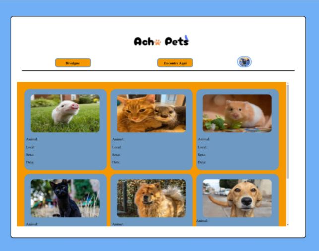
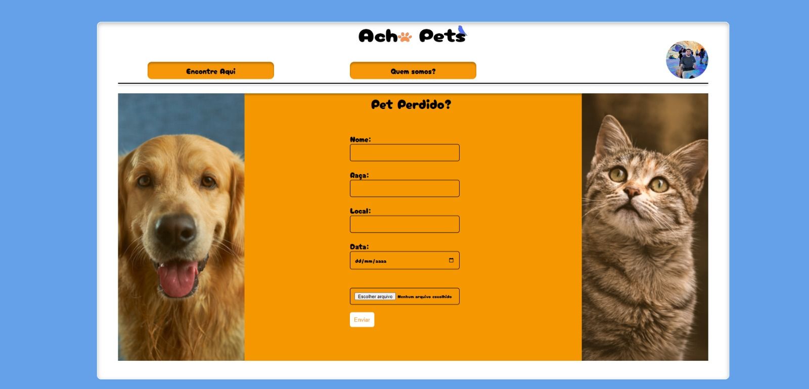
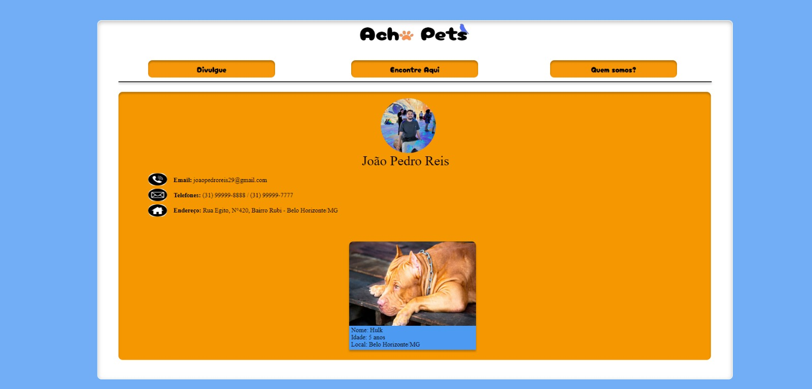
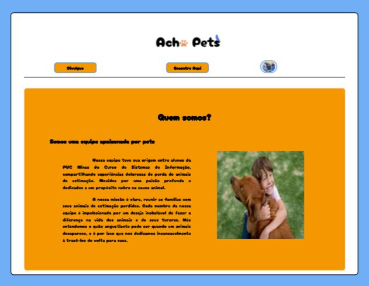

# Projeto de Interface

Visão geral da interação do usuário pelas telas do sistema e protótipo interativo das telas com as funcionalidades que fazem parte do sistema (wireframes).

 Apresente as principais interfaces da plataforma. Discuta como ela foi elaborada de forma a atender os requisitos funcionais, não funcionais e histórias de usuário abordados nas <a href="2-Especificação do Projeto.md"> Documentação de Especificação</a>.

## User Flow

Fluxo de usuário (User Flow) é uma técnica que permite ao desenvolvedor mapear todo fluxo de telas do site ou app. Essa técnica funciona para alinhar os caminhos e as possíveis ações que o usuário pode fazer junto com os membros de sua equipe.

## Wireframes

São protótipos usados em design de interface para sugerir a estrutura de um site web e seu relacionamentos entre suas páginas. Um wireframe web é uma ilustração semelhante do layout de elementos fundamentais na interface.

### Wireframes do site

A página inicial apresenta no topo a logo do site, em seguida temos um container que no topo dele tem os botões de navegações para outras páginas, mais abaixo temos temos um container com as fotos e informações dos últimos 3 pets cadastrados no nosso site e mais abaixo temos outros dois containers, um na esquerda que tem depoimentos de pessoas que já utilizaram nosso site e na direita com nossas informações de contato.

A página "Encontre Aqui" apresenta no topo a logo do site, em seguida temos um container que no topo dele tem os botões de navegações para outras página e uma barra de pesquisas para procurar o cão pela raça, local ou pelo nome caso saibam e dentro desse container temos um outro container onde ficam os animais que foram cadastrados, com fotos, nome, raça e demais coisas do animal.

A tela de divulgação apresenta um formulário breve, onde é possível informar dados sobre seu pet perdido. O formulário ao centro apresenta um elemento para envio de imagens e 3 elementos para adicionar texto(Nome, Idade e Localização). Ao topo se encontra o menu para navegar entre as diferentes páginas do site.

A página do perfil apresenta no topo a logo do site, em seguida temos um container que no topo dele tem os botões de navegações para outras páginas, mais abaixo temos temos um container com a foto e as informações do usuário e se ele já fez alguma divulgação de algum animal.

A página quem somos apresenta no topo a logo do site, em seguida temos um container que no topo dele tem os botões de navegações para outras páginas, mais abaixo temos temos um container com uma foto de uma criaça abraçando um cachorro que representa o amor do grupo pelos animais e um texto explicando quem somos e porque temos o objetivo de fazer o site.

