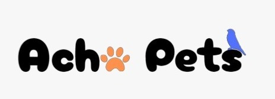

## Apresentação

https://github.com/ICEI-PUC-Minas-PMV-SI/pmv-si-2023-2-pe5-t4-t5-grp02/assets/133276107/ba6938f4-5a4f-443a-82a0-c6ced3ce2324

## Título do Projeto

Acha Pets

## Identidade Visual (Marca, Design)
Marca:

Cores:
Nós optamos para termos um site com cores que relembrem animais, baseado em algumas empresas que já trabalham com animais e verificamos que geralemnte as cores usadas são Branco, Laranja e Azul, que foram as cores que usamos em nosso site.

Design:
O Design nós preferimos fazer um Design mais "Infantil", pois observamos que quando estamos falando de animas muitas pessoas consideram os animais como filhos, o que nos influenciou a fazer o design do site com uma pegada mais infantil.

## Conjunto de Slides (Estrutura)

Os slides da apresentação foram postados na mesma pasta com o nome "Apresentação SI PDF" [presentation](../presentation)
 

## Vídeo de demonstração

https://github.com/ICEI-PUC-Minas-PMV-SI/pmv-si-2023-2-pe5-t4-t5-grp02/assets/133276107/453185d7-0342-4109-b619-2c833fdb222d

